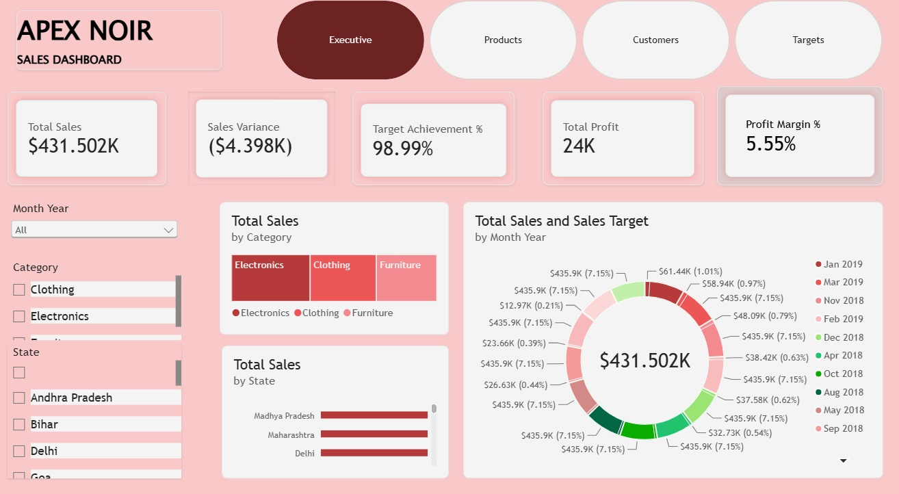
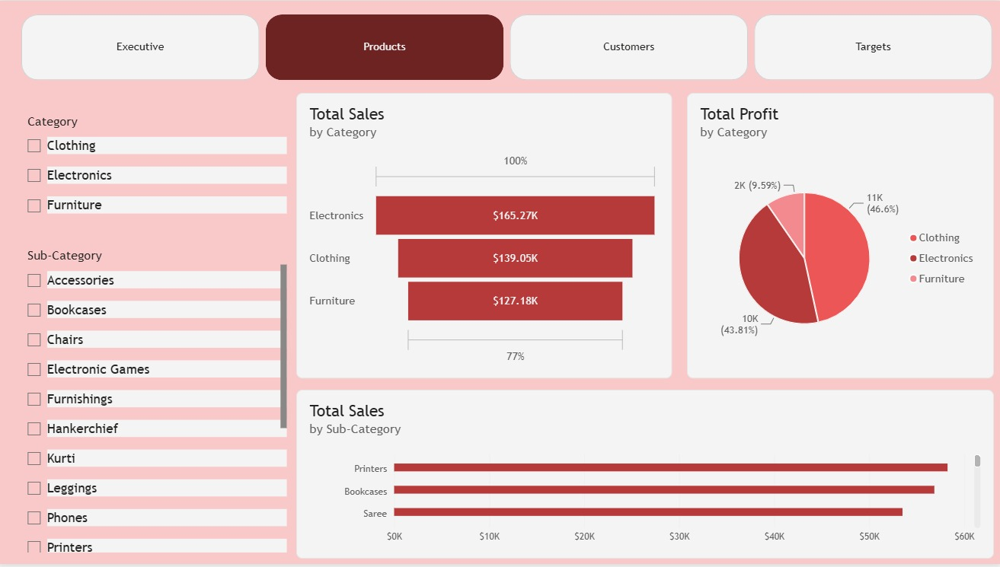
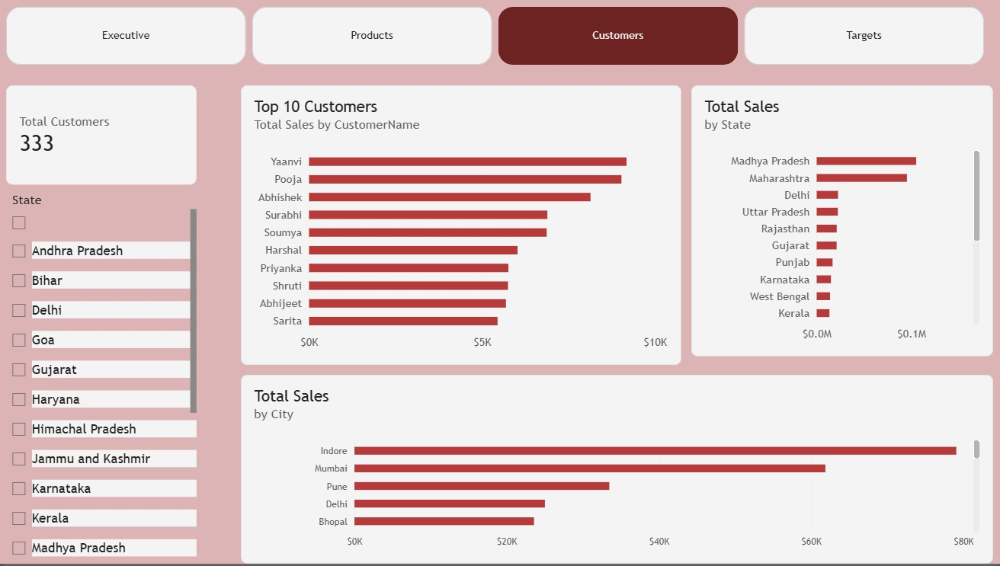
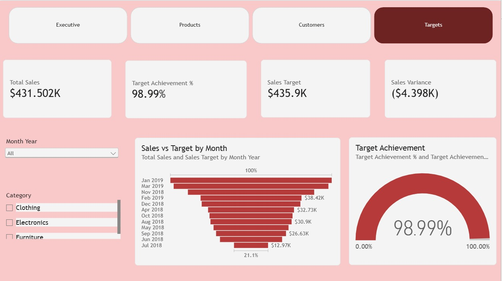

# 📊 Sales Intelligence Dashboard

An interactive **Power BI Sales Intelligence Dashboard** designed to transform raw sales data into clear, actionable business insights.

The dashboard provides a complete view of **sales performance, profitability, products, customers, regional performance, and target achievement** through interactive visuals, KPIs, filters, and page navigation.

---

## 🚀 Dashboard Overview

The project contains four interactive Power BI pages:

| Page | Purpose |
|------|---------|
| 📈 Executive | Overall business performance and key KPIs |
| 🛍️ Products | Product and category-level sales & profit analysis |
| 👥 Customers | Customer performance and geographical sales analysis |
| 🎯 Targets | Sales targets, achievement, and variance analysis |

---

## 📸 Dashboard Preview

### 1. Executive Dashboard


### 2. Products Dashboard


### 3. Customers Dashboard


### 4. Targets Dashboard

---

# 🧩 Key Features

### 📌 Interactive KPIs
The dashboard tracks important business metrics including:

- Total Sales
- Total Profit
- Profit Margin
- Sales Target
- Sales Variance
- Target Achievement
- Total Customers

### 🎛️ Interactive Filters

Users can dynamically filter the analysis using:

- Month / Year
- Category
- State
- Sub-Category

### 🧭 Page Navigation

The dashboard includes navigation between:

**Executive → Products → Customers → Targets**

This allows users to move between different areas of business analysis without leaving the report.

---

# 📊 Data Analysis

The dashboard provides insights across multiple dimensions:

- **Time:** Monthly and yearly sales trends
- **Products:** Categories and sub-categories
- **Customers:** Individual customer performance
- **Geography:** State and city-level sales
- **Targets:** Actual sales vs sales targets
- **Profitability:** Profit and profit margin analysis

---

# 🛠️ Tools & Technologies

- **Power BI Desktop**
- **Power Query**
- **DAX**
- **Data Modeling**
- **Interactive Data Visualization**

---

# 📁 Repository Structure

```text
Sales-Intelligence-Dashboard/
│
├── 📂 Data Files/
│   └── Source datasets
│
├── 📂 ss/
│   ├── sales dashboard ss1.jpeg
│   ├── sales dashboard ss2.jpeg
│   ├── sales dashboard ss3.jpeg
│   └── sales dashboard ss4.jpeg
│
├── 📊 dashboard apex.pbix
│
└── 📄 README.md
